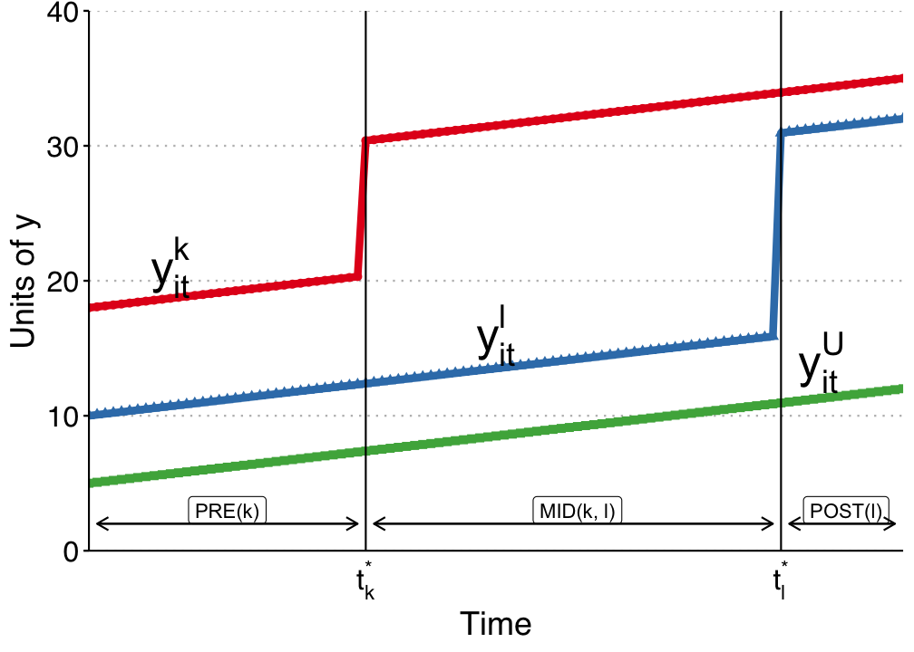

# Difference-in-Differences

```{julia}
#| include: false
using DataFrames
using DataFramesMeta
using Panelest
using Vcov
using StatsModels
import StatsAPI: coeftable
using ReadStatTables
using CSV
using SynthDiD
using CairoMakie
CairoMakie.activate!(type = "png")
using Statistics
using Printf
using RegressionTables
using Random
using Distributions
include("regtable_helpers.jl")

```

```{julia}
#| eval: false
using DataFrames
using DataFramesMeta
using Panelest
using Vcov
using StatsModels
import StatsAPI: coeftable
using ReadStatTables
using CSV
using SynthDiD
using CairoMakie
CairoMakie.activate!(type = "png")
using Statistics
using Printf
using RegressionTables
using Random
using Distributions
```

When unconfoundedness fails, we need weaker assumptions. The parallel trends assumption leads to the difference-in-differences estimator.

> **Related reading**: For a side-by-side comparison of DiD, synthetic
> control, synthetic DiD, and multivariate SC on a *single* panel — and
> how the choice of estimator changes the answer — see the
> [Same data, different estimators](https://xiangao.github.io/blog_book/same-data-different-estimators.html)
> chapter of *Topics on Econometrics and Causal Inference*.

## $T=2$ Panel Data

Suppose we have two periods, $t = (1,2)$. Some units are treated just prior to period 2. For each individual $i$, there are four potential outcomes:

$$ [Y_{i1}(0), Y_{i1}(1), Y_{i2}(0), Y_{i2}(1)] $$ {#eq-did-1}

Let $D$ denote the treated group. The ATT in period 2 is

$$ \tau_{2,att} = E(Y_2(1) - Y_2(0) | D=1) $$ {#eq-did-2}

The first term is observed. The second is the counterfactual.

## Parallel Trends Assumption

$$ E[Y_2(0) -Y_1(0) | D=1] = E[Y_2(0) - Y_1(0) | D =0] $$ {#eq-did-3}

or

$$ E[\Delta Y(0) | D=1] = E[\Delta Y(0) | D =0] $$ {#eq-did-4}

In words, the change in untreated potential outcomes between periods 1 and 2 is the same for treated and control groups.

## No Anticipation Assumption

$$ E[Y_1(1) - Y_1(0) | D=1] = 0 $$ {#eq-did-5}

This is to say, in period 1, there is no treatment effect for the treated group.

## DiD is Identified with PT and NA

With Parallel Trends, we notice $$\small  E[Y_2(0) | D=1 ]= E[Y_1(0) | D=1] + E[Y_2(0) - Y_1(0) | D=0] $$ {#eq-did-6}

Then, with No Anticipation, $$
\begin{aligned}
E[Y_2(0) | D=1 ] &= E[Y_1(1) | D=1] + E[Y_2(0) - Y_1(0) | D=0]\\
&= E[Y_1 | D=1] + E[Y_2-Y_1 | D=0]
\end{aligned}
$$ {#eq-did-7} 

$$\small  \tau_{2,att} = E[Y_2 - Y_1 | D=1] - E[Y_2-Y_1 | D=0] $$ {#eq-did-8}

## Advantages and Disadvantages of DiD

Advantages:

-   No need to assume unconfoundedness. We "only" need PT and NA. Or say we don't need treatment itself to be independent of potential outcomes, but we do need it to be independent to the change in potential outcome at least for untreated state. This is importantly weaker in a lot of situations. There can be selection bias. If the selection bias does not change over time, then DiD can handle it.

Disadvantages:

-   PT and NA might be violated.
-   PT is not scale free, in the sense that even if outcome can have PT, but then non-linear transformation of outcome won't have PT (for example log of Y).

## Traditional DiD

In practice, DiD in many period setting is usually done with

$$ Y_{it} = \alpha_i + \phi_t + W_{it} \beta + \epsilon_{it} $$ {#eq-did-9}

here $W_{it} =(1[t=2] \cdot D_i)$, which is the interaction of post-treatment indicator and treatment group indicator.

This is usually called Two Way Fixed Effect (TWFE). There are multiple ways to implement the same model in practice.

TWFE can be done by "Pooled OLS". That is, using OLS on time dummies and firm (individual) dummies. Wooldridge (2021) shows it's equivalent to use treatment dummies, instead of individual dummies. He also shows that this model can be equivalently implemented with fixed effect model and random effect model.

## TWFE with Staggered Treatment Timing

The problem comes in when there is different timing of treatment. People used to still use

$$ Y_{it} = \alpha_i + \phi_t + W_{it} \beta + \epsilon_{it} $$ {#eq-did-10}

where $W_{it}$ now is a dummy when an individual $i$ gets treated at time $t$.

However, what is $\beta$ here?

## Goodman-Bacon Decomposition

Goodman-Bacon (2021) showed that $\beta$ in the TWFE is a weighted average of many different treatment effects, between treated cohorts, and control units, both can be different at different time points. The weights are a function of the size of the subsample, relative size of treatment and control units, and the timing of treatment in the sub sample. The decomposition weights themselves are non-negative and sum to one; the problem is that the units treated earlier are used as controls later. When those "forbidden" 2x2 comparisons are expressed in terms of the underlying cohort-time ATTs, some ATTs receive negative weight (de Chaisemartin and D'Haultfœuille 2020). Therefore there is no meaningful interpretation of $\beta$: it does not need to be a convex combination of treatment effects.




## Wooldridge's ETWFE

There are a lot of ways to deal with staggered DiD situation. Wooldridge (2021) is basically saying: This is not a problem of TWFE, it's a mis-use of TWFE. The reason we get non-sensible result of $\beta$ is that we know there is heterogeneous treatment effect, in the sense the treatment effect differs across cohort, but we force them to be the same. If we relax it, it can work. As he shows, this works when we specify cohort effects accordingly.

$$ y_{it} = \alpha_i + \phi_t + \sum_{g=g_0}^G \sum_{t=g}^T \lambda_{g,t} \times 1(g,t) + \epsilon_{i,t} $$ {#eq-did-11}

Here $g$ is a cohort indicator, a cohort is determined by the time of getting treatment. ETWFE is allowing each cohort to have different effect at each different time point after being treated. The baseline group is the never treated group. If there is no never treated group, it can easily changed to comparing to the last treated group.

## Example 1: US Teen Employment

We'll use the mpdta dataset on US teen employment from the did package. "Treatment" in this dataset refers to an increase in the minimum wage rate. Our goal is to estimate the effect of this minimum wage treatment (treat) on the log of teen employment (lemp). Notice that the panel ID is at the county level (countyreal), but treatment was staggered across cohorts (first_treat) so that a group of counties were treated at the same time. In addition to these staggered treatment effects, we also observe log population (lpop) as a potential control variable.

```{julia did1}
#| warning: false
#| cache: true
#| echo: true
# Load mpdta dataset from the did R package (Callaway & Sant'Anna 2021)
# US teen employment data; treatment = minimum wage increase
mpdta = CSV.read("data/mpdta.csv", DataFrame)
rename!(mpdta, "first.treat" => "first_treat")
first(mpdta, 6)
```

```{julia did2}
#| warning: false
#| cache: true
#| echo: true
combine(groupby(mpdta, :year), nrow)
combine(groupby(mpdta, :treat), nrow)
combine(groupby(mpdta, :first_treat), nrow)
```

```{julia did3}
#| warning: false
#| cache: true
#| echo: true
# String columns enable StatsModels to generate cohort×time dummies (ETWFE)
mpdta.first_treat_str = string.(mpdta.first_treat)
mpdta.year_str = string.(mpdta.year)

mod = feols(mpdta, @formula(lemp ~ lpop + first_treat_str & year_str + fe(countyreal) + fe(year)), vcov = Vcov.cluster(:countyreal));
```

```{julia did4}
#| warning: false
#| cache: true
#| echo: true
show_regression_html(mod)
```

```{julia did5}
#| warning: false
#| cache: true
#| echo: true
emfx(mod)
```

```{julia did6}
#| warning: false
#| cache: true
#| echo: true
mod_es = emfx(mod, type = "event")
mod_es
```

```{julia did7}
#| warning: false
#| cache: true
#| echo: true
mod_es2 = emfx(mod, type = "event", post_only = false)

fig = Figure()
ax = Axis(fig[1, 1], 
    xlabel = "Years post treatment", 
    ylabel = "Effect on log teen employment",
    title = "Note: Zero pre-treatment effects for illustrative purposes only.")

hlines!(ax, 0, color = :black)
vlines!(ax, -1, color = :black, linestyle = :dash)

rangebars!(ax, mod_es2.event, mod_es2.conf_low, mod_es2.conf_high, color = :darkcyan)
scatter!(ax, mod_es2.event, mod_es2.estimate, color = :darkcyan)

fig
```

## Example 2: Staggered DiD

```{julia did8}
#| warning: false
#| cache: true
#| echo: true
did_data = DataFrame(readstat("data/did_staggered_6.dta"))
@rtransform! did_data :first_treat = begin
    if :d4 == 1
        2004
    elseif :d5 == 1
        2005
    elseif :d6 == 1
        2006
    else
        0
    end
end

first(select(did_data, :id, :year, :y, :x, :d4, :d5, :d6, :te4, :te5, :te6, :first_treat), 6)
```

```{julia did19}
#| warning: false
#| cache: true
#| echo: true
combine(groupby(did_data, :first_treat), nrow)
```

```{julia did9}
#| warning: false
#| cache: true
#| echo: true
@rtransform! did_data :treated_cohort1 = begin
    if :d4 == 1 && :f04 == 1
        "d4f04"
    elseif :d4 == 1 && :f05 == 1
        "d4f05"
    elseif :d4 == 1 && :f06 == 1
        "d4f06"
    else
        missing
    end
end

@rtransform! did_data :treated_cohort2 = begin
    if :d5 == 1 && :f05 == 1
        "d5f05"
    elseif :d5 == 1 && :f06 == 1
        "d5f06"
    else
        missing
    end
end

@rtransform! did_data :treated_cohort3 = begin
    if :d6 == 1 && :f06 == 1
        "d6f06"
    else
        missing
    end
end

combine(groupby(dropmissing(did_data, :treated_cohort1), :treated_cohort1), :te4 => mean => :mean4)
```

```{julia did10}
#| warning: false
#| cache: true
#| echo: true
combine(groupby(dropmissing(did_data, :treated_cohort2), :treated_cohort2), :te5 => mean => :mean5)
combine(groupby(dropmissing(did_data, :treated_cohort3), :treated_cohort3), :te6 => mean => :mean6)
```

```{julia did11}
#| warning: false
#| cache: true
#| echo: true
# String columns needed for cohort×time ETWFE dummies
did_data.first_treat_str = string.(did_data.first_treat)
did_data.year_str = string.(did_data.year)

# this replicates Jeff's results with pooled ols or xtreg, with covariate x.
mod = feols(did_data, @formula(y ~ x + first_treat_str & year_str + fe(id) + fe(year)), vcov = Vcov.cluster(:id))
show_regression_html(mod)
```

```{julia did12}
#| warning: false
#| cache: true
#| echo: true
emfx(mod)
```

```{julia did20}
#| warning: false
#| cache: true
#| echo: true
mod_es = emfx(mod, type = "event")
mod_es
```

```{julia did21}
#| warning: false
#| cache: true
#| echo: true
mod_es2 = emfx(mod, type = "calendar")
mod_es2
```

## Nonlinear ETWFE: Count and Binary Outcomes

ETWFE is not limited to linear outcomes. When $Y$ is a count or binary variable, the key identifying assumption shifts to **Conditional Parallel Trends on the linear index**: parallel trends on $\log E[Y_{it}(\infty)]$ for Poisson, or on $\text{logit}\, E[Y_{it}(\infty)]$ for logit. This is Wooldridge's (2023, 2026) CPT assumption stated on $G^{-1}(E[Y])$.

The correct Wooldridge ETWFE specification for a nonlinear model uses:
- **Cohort FE** (one intercept per treatment cohort, including never-treated): captures selection into treatment
- **Year FE** (common time trend): identified from never-treated units
- **Post-treatment cohort×year dummies** (one per treated cohort per post-treatment year): capture the ATTs on the log scale

Critically, this is a **pooled model**, not a within-estimator. In the *linear* Gaussian examples above, unit FE and cohort FE give numerically identical ATTs (Wooldridge 2021). In nonlinear models, however, unit fixed effects raise the incidental-parameters problem and make average partial effects uncomputable — the unit intercepts cannot be averaged out of the nonlinear link. Wooldridge (2023) instead uses cohort intercepts (a Mundlak device), which is what `etwfe` implements; that is why the cohort-FE requirement matters only for Poisson/logit ETWFE.

### Simulated example: staggered count data

We simulate panel data with three treatment cohorts (treated in years 3, 4, 5) and a never-treated group. The true treatment effect is multiplicative: $\exp(0.4) - 1 \approx 49\%$ increase in counts. Parallel trends holds on the log scale.

```{julia did_pois0}
#| warning: false
#| cache: true
#| echo: true
Random.seed!(42)
N_pois = 600; Tmax_pois = 6
unit_fe_vals = randn(N_pois) .* 0.3
rows_p = [(id=i, year=t) for i in 1:N_pois for t in 1:Tmax_pois]
df_count = DataFrame(rows_p)
sort!(df_count, [:id, :year])

cohort_grp = ((df_count.id .- 1) .÷ 150) .+ 1
df_count.first_treat = [3, 4, 5, 0][cohort_grp]   # 0 = never treated
df_count.treated = (df_count.first_treat .> 0) .& (df_count.year .>= df_count.first_treat)
df_count.unit_fe = unit_fe_vals[df_count.id]
df_count.log_mu = 1.0 .+ 0.2 .* df_count.year .+ df_count.unit_fe .+ 0.4 .* df_count.treated
df_count.count = rand.(Poisson.(exp.(df_count.log_mu)))

combine(groupby(df_count, [:first_treat, :treated]), :count => mean => :mean_count)
```

### Poisson ETWFE

`etwfe()` handles formula construction, cohort FE + year FE, and post-treatment dummy creation automatically. Pass `family = "poisson"` for count outcomes.

```{julia did_pois1}
#| warning: false
#| cache: true
#| echo: true
mod_pois = etwfe(df_count, @formula(count ~ 1);
                 gvar = :first_treat, tvar = :year,
                 family = "poisson", vcov = Vcov.cluster(:id))

# Show the coefficient table explicitly. Letting the returned struct be the
# cell's display value prints a raw
# `ETWFEResult(Panelest Model: ... CoefTable(Any[[...]]))` dump, because neither
# ETWFEResult nor CoefTable defines a text/plain show method that Jupyter picks
# up in that position.
show_regression_html(mod_pois.model)
```

```{julia did_pois2}
#| warning: false
#| cache: true
#| echo: true
att = emfx(mod_pois)
@printf("ATT (log scale):  %.4f  (SE = %.4f)\n", att.estimate[1], att.std_error[1])
@printf("IRR - 1:          %.4f  (true ≈ 0.492)\n", exp(att.estimate[1]) - 1)
```

The ATT is on the **log scale** (log incidence rate ratio). Exponentiate and subtract 1 for the proportional increase in counts.

### Event study

```{julia did_pois3}
#| warning: false
#| cache: true
#| echo: true
mod_pois_es = emfx(mod_pois, type = "event")

fig_p = Figure()
ax_p  = Axis(fig_p[1, 1],
    xlabel = "Years post treatment",
    ylabel = "ATT (log scale)",
    title  = "Poisson ETWFE event study")
hlines!(ax_p, 0, color = :black, linewidth = 1)
rangebars!(ax_p, mod_pois_es.event,
           mod_pois_es.conf_low, mod_pois_es.conf_high, color = :darkcyan)
scatter!(ax_p, mod_pois_es.event, mod_pois_es.estimate, color = :darkcyan)
fig_p
```

### Comparison: linear ETWFE on log(count + 1)

```{julia did_pois4}
#| warning: false
#| cache: true
#| echo: true
df_count.log_count = log.(df_count.count .+ 1)

mod_lin = etwfe(df_count, @formula(log_count ~ 1);
                gvar = :first_treat, tvar = :year,
                vcov = Vcov.cluster(:id))
emfx(mod_lin)
```

The linear model estimates the ATT on the $\log(Y+1)$ scale — a different and less interpretable quantity than the Poisson log IRR.

## Spatial Interference

Everything in this chapter so far assumes SUTVA: one unit's outcome does not depend on another unit's treatment. That is not always plausible. A treated municipality may affect deforestation in nearby untreated municipalities. A vaccinated household may reduce transmission to nearby households. A labor-market policy in one commuting zone may change flows to its neighbors. With this kind of spatial spillover, the usual DiD estimand no longer has the interpretation we want. Xu [-@xu2023] shows that ignoring interference can produce an estimand that is neither a direct effect nor a spillover effect.

Xu [-@xu2023; -@xu2026] develops a doubly robust DiD that keeps the identifying logic of conditional parallel trends but adds an exposure mapping $G_{it} = G(i, W_{-it})$ for unit $i$'s neighborhood treatment status. The estimand is the direct ATT at exposure level $g$,

$$ \tau_g(t, c) = \frac{1}{|S_M|} \sum_{i \in S_M} \mathbb{E}[y_{it}(c, g) - y_{it}(\infty, g) \mid z_i, C_i = c, G_{it} = g], $$ {#eq-did-12}

where $C_i$ is unit $i$'s first treatment period (so $\{C_i > t\}$ is the not-yet-directly-treated comparison group), $S_M = \{C_i = c\} \cup \{C_i > t\}$, and $g$ is a chosen exposure level. The DR plug-in averages three pieces over $S_M$: an IPW term from the treated cohort, an IPW term from the not-yet-treated, and a regression-imputation term, with three propensity models ($\eta_{tc}$ for cohort, $\eta_{tcg}$ and $\eta_{t\infty g}$ for exposure) and two outcome-change regressions. It is consistent if either all three propensities or both outcome models are correctly specified.

The companion package [`DidInterference.jl`](https://github.com/xiangao/DidInterference.jl) implements this. The 2×2 base case (Xu 2023):

```{julia did_int_2x2_demo}
#| eval: false
using DidInterference, DataFrames

res = did_int_2x2(panel;
    yname     = :Y_post,
    yname_pre = :Y_pre,
    treat     = :W,
    exposure  = :G,
    g         = 1,
    covariates = [:z1, :z2],
    trim       = 0.01)   # Xu (2026) uses 0.01 in the Brazil application

println(res.estimate, "  ", res.ci)
```

For staggered adoption (Xu 2026), `did_int_staggered()` loops over `(cohort, time)` cells with $t \geq c$, restricts to $S_M$ in each cell, fits the DR estimator, and aggregates across cells using joint-IF stacking (per-cell IFs share the never-treated comparison group, so independence-style SEs underestimate uncertainty noticeably). An R port with the same interface is available as [`didint`](https://github.com/xiangao/didint); its Brazil Amazon `Lista de Municípios Prioritários` vignette replicates Section III of Xu (2026) using the public Assunção-McMillan-Murphy-Souza-Rodrigues replication archive on Zenodo.

## Persistent Outcomes and Heterogeneous Dynamics

Standard event-study TWFE regressions like

$$ Y_{it} = \alpha_i + \gamma_t + \sum_{j} D_{it}^j \delta_j + X_{it}'\beta + U_{it} $$ {#eq-did-13}

implicitly assume the residual has no serial dependence once unit and
time fixed effects are absorbed. When outcomes are genuinely
persistent — earnings, employment, consumption, anything with habits
or adjustment costs — that assumption fails. The event-time dummies
absorb persistence on top of the true causal effect, producing
spurious pre-trends and biased post-treatment estimates whose bias
grows geometrically with the event-time horizon
(Botosaru and Liu 2025, Figure 1).

Botosaru and Liu [-@botosaru-liu-2025] introduce a **dynamic panel
with correlated random coefficients** that handles both persistence
and unit-level heterogeneity in dynamic responses:

$$ Y_{it} = \rho_Y Y_{i,t-1} + \alpha_i + \sum_j D_{it}^j \delta_{ij} + X_{it}'\beta + U_{it}, $$ {#eq-did-14}

with a parsimonious AR(1) on the event-time effects to keep
dimensionality manageable:

$$ \delta_{ij} = \rho_\delta \delta_{i,j-1} + \varepsilon_{ij}, \quad j \geq 1. $$ {#eq-did-15}

The latent $\lambda_i = (\alpha_i, \delta_{i0})$ is a unit-specific
correlated random coefficient. A two-step semiparametric estimator:
step 1 is **quasi-maximum likelihood** for the common parameters
under a Gaussian working assumption on $\lambda_i$ (consistent under
misspecification); step 2 is **Tweedie / Gaussian-conjugate empirical
Bayes** for the unit-level posterior trajectories
$\{\delta_{i,j}\}_{j=0}^J$.

A companion note [@botosaru-liu-2026] adds a **homogeneous-feedback
extension**: covariates $X_{it}$ are allowed to adjust endogenously to
past $Y$ and treatment. Under the assumption that the covariate
adjustment rule does not depend on $\lambda_i$ given the observable
history, the likelihood factors into a structural piece and a feedback
piece, yielding a clean decomposition of dynamic treatment effects
into **direct** (through $\delta_{i,j}$) and **indirect** (through
covariate feedback) components.

The package [`TVHTE.jl`](https://github.com/xiangao/TVHTE.jl)
implements both papers:

```{julia tvhte_demo}
#| eval: false
using TVHTE

# Fit on a panel with staggered cohorts and a covariate
fit = tvhte(panel_Y, baseline_Y; t0 = cohort, J = max_event_time, X = panel_X)

# Feedback model + direct/indirect counterfactual decomposition
fb = fit_feedback(panel_Y, baseline_Y, panel_X, baseline_X)
cf = simulate_counterfactual(fit, fb, alt_cohort)
```

An R port with the same API is at
[`tvhte`](https://github.com/xiangao/tvhte); both packages have
deployed docs at <https://xiangao.github.io/TVHTE.jl/> and
<https://xiangao.github.io/tvhte/>.

Synthetic control, synthetic DiD, and TASC are closely related enough that we treat them together in the next design chapter.
